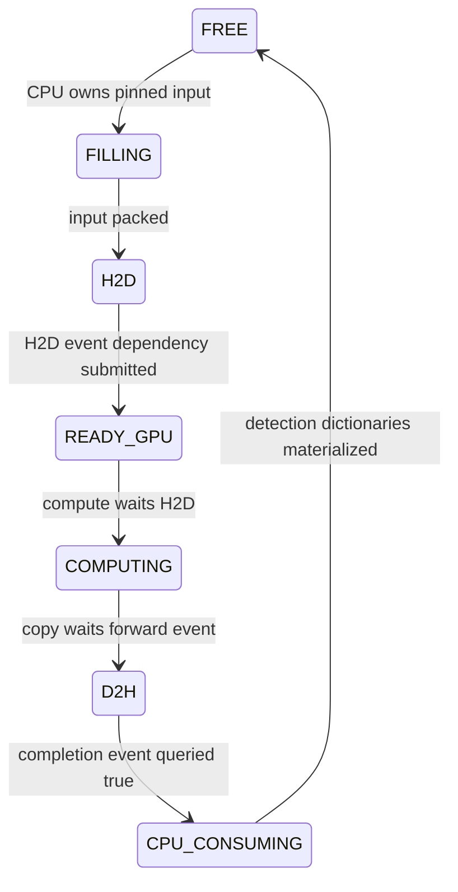

# CUDA implementation contract

The installed runtime is PyTorch 2.14.0 with CUDA 13.0. The reference is the
[versioned CUDA semantics](https://docs.pytorch.org/docs/2.14/notes/cuda.html),
read together with the installed Python source. Transformers is pinned to 4.46.3;
its [DETR processor source](https://github.com/huggingface/transformers/blob/v4.46.3/src/transformers/models/detr/image_processing_detr.py)
defines `pad_size`, `pixel_mask`, and original-size box decoding.

## Addresses and ownership

Each `(bucket, slot)` owns its host inputs, device inputs, host outputs, events,
and graph. Full DETR forward is captured at those device addresses. Model weights
are read-only. There is one compute stream and distinct H2D/D2H streams.
Graphs use private pools; there is no concurrent graph execution on two compute
streams. New request tensors are copied into the owning slot; passing a new
tensor to an unrelated Python variable never replaces a captured address.

Initialization/zero-fill takes place on the caller's stream. All three side
streams wait on that stream before their first operation. Warmup precedes capture.
Mask values remain dynamic input data at fixed addresses: valid resized pixels
are one, right/bottom padding is zero. Capture never removes a mask. Dummy lanes
duplicate a valid image and mask; only real lanes are decoded.

## Slot transitions

`H2D`, `READY_GPU`, `COMPUTING`, and `D2H` describe submitted dependencies, not
host observations of physical GPU completion. The final event is the ownership
boundary. No input or output is reused while a slot is busy. Eager output tensors
remain strongly referenced through the copy. The CPU finishes decoding and
materializing ordinary Python results before the slot becomes free.

The online harness admits at most two batches globally: executing work and one
locked next batch. New EDF arrivals cannot alter either submitted batch. Serial
policies admit one batch and do not overlap CPU preprocessing with GPU inference.
The optimized path queries per-slot events; device-wide synchronization is used
only during initialization, offline correctness/quality tests, and final cleanup.

## Timing and drain

CPU stage timestamps use `monotonic_ns`. CUDA event durations use a distinct
device clock; they are never subtracted from host timestamps. `d2h_observed_ns`
is the host observation, not an invented GPU timestamp. The profiler provides a
correlated timeline separately from formal timing runs.

The drain cap closes the observation window before cleanup. Results obtained
during cleanup do not retroactively turn unfinished requests into completions.
Every measurement-cohort request remains in the SLO denominator. Completed
percentiles, completion ratio, and goodput are reported together.
