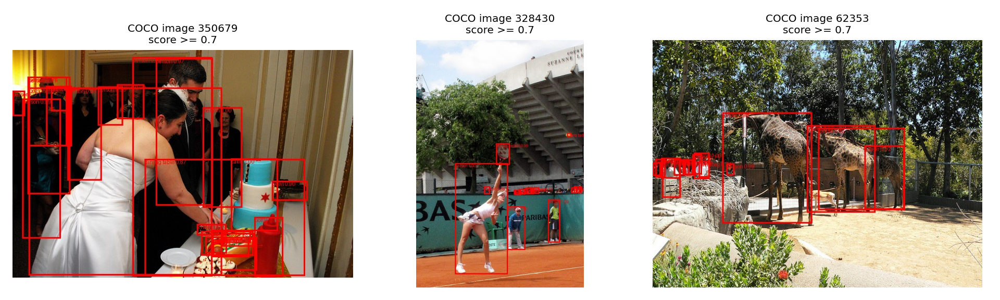
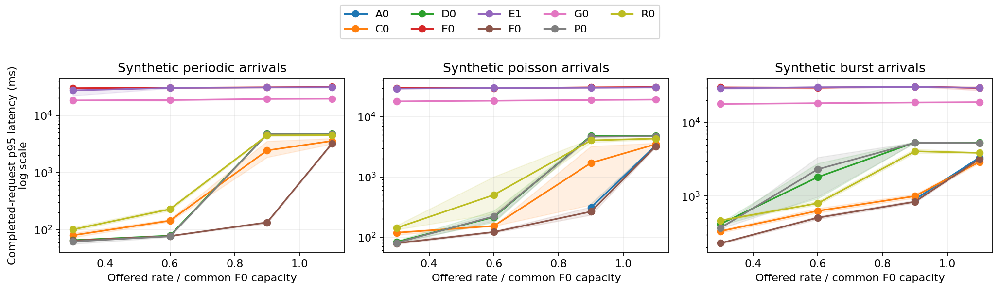
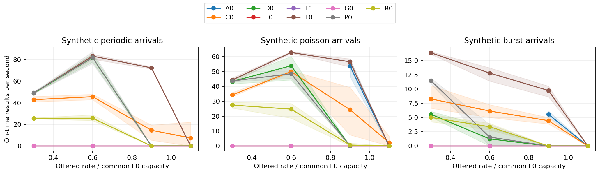
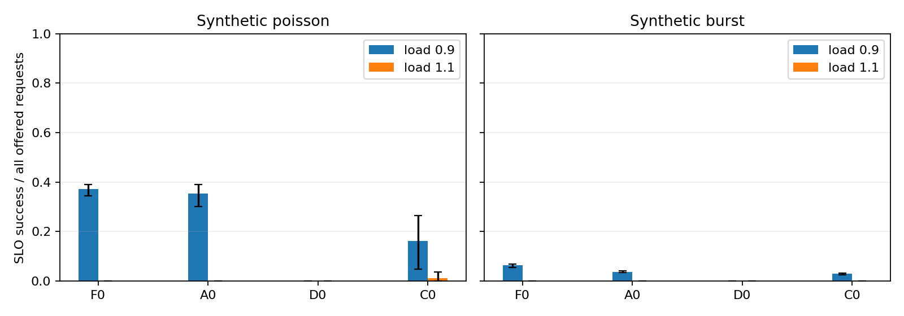
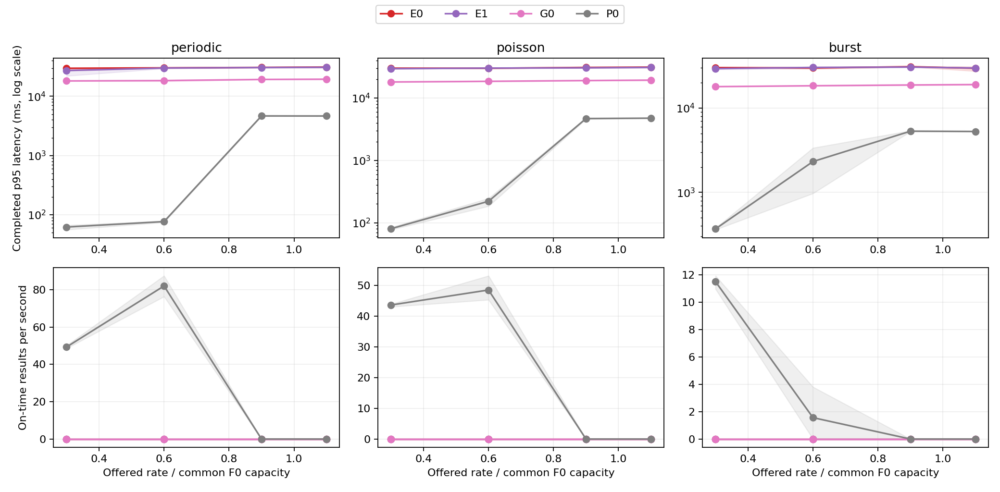
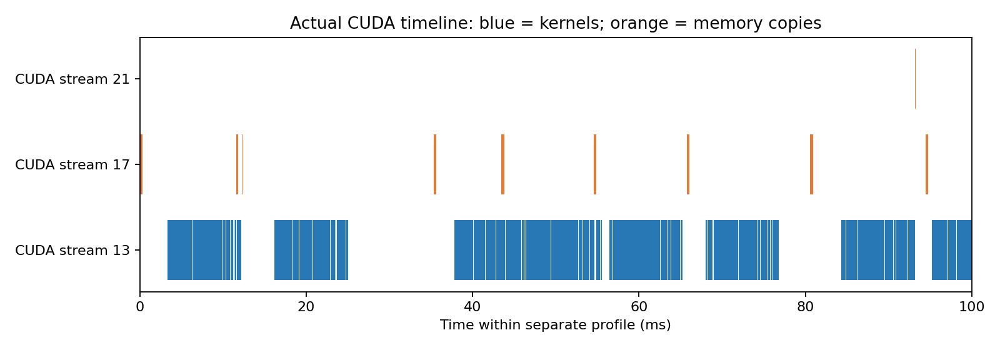

# Deadline-Aware Object Detection Serving on H800 with CUDA Graphs and CPU-GPU Pipelining

CISC8005 course project — measured protocol v2

## 1. Abstract and research question

We study pretrained DETR object detection serving on one NVIDIA H800 PCIe. The workload starts from cached compressed COCO image bytes and ends when CPU detection dictionaries are available. We keep model weights, masks, resolution, precision, and decoding common while varying graph execution, buffering, pipeline overlap, and batching. The evaluation contains 300 completed real-image serving cases with synthetic open-loop arrivals, plus independent detection quality on all 4,000 held-out validation images. Same-precision eager batch-one AP is 36.312; the largest observed backend/bucket AP change is 0.000112 percentage points. Across paired main settings, D0 minus tuned F0 mean goodput is -14.375 requests/s. This aggregate is descriptive, not a significance test or a guarantee across loads.

Interactive detection combines CPU image work, host submission, device execution, copying, and queueing. A shorter GPU forward alone does not establish shorter request latency. Likewise, reporting only completed-request latency can hide overload rejection. We ask three questions: which stages constrain this detector on this hardware; what graph replay and explicit buffer ownership change; and whether a measured-service-time batching heuristic improves deadline satisfaction over a tuned fixed timer.

The contribution is an implementation and controlled evaluation for a computer vision course. CUDA Graphs, pinned memory, asynchronous streams, EDF, and deadline feasibility already exist. We do not claim a new detection architecture or a new general serving algorithm. The visual boundary is concrete: real RGB images enter, COCO categories and original-coordinate boxes leave, and the quality constraint is tested independently of which online requests finish on time.

There is no model training, camera ingestion, HTTP/RPC service, tracking, or production traffic. Rates and deadlines are normalized research choices. The primary comparison is against the strongest valid backend represented in the evidence, with F0/A0/D0 isolating execution from queue ordering and service-time feasibility.

## 2. Background and related work

DETR uses a convolutional backbone and transformer encoder-decoder with a fixed set of object queries and classification/box heads. We use the authors' existing COCO checkpoint rather than train a model. Our 480/640 resize and 640-square padding are deployment settings, so the resulting subset AP is not an attempted reproduction of the original paper's higher-resolution full-validation result. [Carion et al., ECCV 2020](https://arxiv.org/abs/2005.12872); [author implementation](https://github.com/facebookresearch/detr).

Clockwork explicitly controls execution and uses model/batch execution profiles and executor availability to predict feasible completion. It maintains batch queues and schedules through latest-start strategies; deadline feasibility and efficient batch selection are therefore established ideas. Our one-model local harness uses a conservative dispatch-to-result percentile and never rejects expired requests selectively. We do not reproduce Clockwork's distributed multi-model controller. [Gujarati et al., OSDI 2020](https://www.usenix.org/conference/osdi20/presentation/gujarati).

Clipper separates framework execution from serving and adapts batch size to a latency target through additive increase and multiplicative decrease. It also supports prediction caching and model composition. Here we disable result caching, fix one detector, and give FIFO timers a finite calibration search. [Crankshaw et al., NSDI 2017](https://www.usenix.org/conference/nsdi17/technical-sessions/presentation/crankshaw).

Triton documents dynamic batching, preferred batch sizes, and maximum queue delay. Our F0 is a local explicitly implemented timer baseline; it is not a full Triton deployment. [NVIDIA dynamic batching documentation](https://docs.nvidia.com/deeplearning/triton-inference-server/user-guide/docs/user_guide/batcher.html).

PyTorch's CUDA semantics require stream ordering and fixed addresses for graph replay. Pinned storage permits asynchronous copies but does not itself prove overlap. We warm up before capture, retain tensor ownership until the final copy event and CPU consumption, and inspect a separate correlated profile. [PyTorch 2.14 CUDA semantics](https://docs.pytorch.org/docs/2.14/notes/cuda.html). The report gives measured scope and negative results rather than extrapolating to another framework, detector, GPU, or Grace/NVLink-C2C platform.

## 3. Execution and scheduling design

A request identifies an image and carries a scheduled arrival and absolute deadline. A separate load-generation process enqueues arrivals without waiting for service; CPU workers decode JPEG bytes and apply the common processor. Ready requests feed a scheduler. Packing fills a fixed host slot, H2D copies populate its device inputs, one compute stream executes eager or captured forward, and D2H copies populate its host logits/boxes. CPU decoding materializes detection dictionaries before releasing the slot.

Every bucket has two independent slots and private graph pools. Events enforce H2D before forward and forward before D2H. Initialization on the caller stream is ordered before side-stream access. At most one executing batch and one locked next batch exist globally. A newly arriving earlier deadline cannot overwrite either submitted batch. Dummy lanes repeat a valid image/mask and never produce real request results. The optimized serving loop queries events without a per-stage device-wide synchronization.

D0 orders ready requests by deadline, arrival, and ID. For each EDF prefix of length n it selects the smallest common bucket b that fits and predicts F(n)=now+G+R_b. G retains the full past service estimate until the GPU forward-start event is observed; only then is host elapsed time subtracted. Queued time therefore cannot exhaust an unstarted batch's estimate. No future completion is inspected. R_b is a calibration dispatch-to-CPU-result p95 including pack, copies, forward, and postprocess. Feasible candidates satisfy the earliest selected deadline; D0 maximizes n/R_b, then prefers an earlier finish and smaller bucket. With no feasible prefix it serves the earliest deadline immediately rather than dropping a difficult request.

Waiting is bounded by the oldest ready timestamp plus frozen tau. The implementation waits for a larger bucket only when its conservative predicted completion still meets the earliest deadline. Arrivals re-trigger the decision without resetting the absolute timer. This is a heuristic: model error, CPU variability, and locked prefetch can still cause misses.

| Bucket | Dispatch-to-CPU-result p95 (ms) |
| --- | --- |
| 1 | 10.473 |
| 2 | 16.957 |
| 4 | 30.057 |
| 8 | 56.690 |

E0 uses pageable synchronous serial copying; E1 uses pinned buffers with a serial pipeline; G0 adds graph replay; P0 adds two-slot pipelining. R0 and F0 use tuned FIFO timers with eager and graph execution respectively. A0 shares F0's timer and executor but changes the ready order to EDF. D0 changes batch feasibility selection. Executor pools remain resident across randomized cases; capture time and scoped storage evidence are reported separately.

## 4. Vision correctness and quality

The immutable model revision is `70120ba84d68ca1211e007c4fb61d0cd5424be54`. Model configuration, processor configuration, and weights have SHA-256 identities. COCO image IDs are numerically sorted and permuted by PCG64 seed 20261008; the first 1,000 form calibration and the remaining 4,000 form held-out evaluation. These are project subsets of official validation, not an official test split. The split and annotation bytes are hashed.

The official processor resizes with shortest edge 480 and longest edge 640 while preserving aspect ratio. It normalizes and pads on the right and bottom to 640x640. The corresponding pixel mask distinguishes real pixels from padding. Tests compare valid pixels and padding against the unpadded official processor path. Box decoding uses the official postprocessor and original image (height,width), including an analytically known box test. COCO's non-contiguous category IDs are checked against checkpoint labels rather than shifted by one.

Calibration eager FP32 AP is 36.084; BF16 AP is 35.956, a signed drop of 0.128 points. The initial 0.3-point drop rule is followed by a pre-freeze bucket stability check; the resulting choice is FP32 for every policy. The recorded fallback reason is Calibration BF16 bucket 2 changes AP by -0.111329 pp (>0.1 pp). This decision uses calibration only. TF32 is disabled and attention implementation is common eager attention. Graph consistency compares 1000 real-image requests drawn repeatedly from 32 calibration images, covering all common buckets, partial occupancy, alternating IDs, reversed independent slots, and delayed CPU consumption. Maximum same-precision logits/box errors are 0/0; raw tolerances are retained in the stress record.

Offline COCOeval uses every held-out image, threshold zero, up to 100 queries, and no added NMS. Runtime optimization must remain within 0.1 AP point of same-precision eager batch one. Scheduler-only policies can share executor AP because request identity and executor correctness are separately validated.

| Backend | Bucket | AP | AP50 | AP75 | AP small | AP medium | AP large |
| --- | --- | --- | --- | --- | --- | --- | --- |
| eager | 1 | 36.312 | 56.329 | 37.476 | 12.041 | 38.624 | 59.573 |
| eager | 2 | 36.312 | 56.329 | 37.476 | 12.041 | 38.624 | 59.573 |
| eager | 4 | 36.312 | 56.329 | 37.476 | 12.041 | 38.624 | 59.573 |
| eager | 8 | 36.312 | 56.329 | 37.476 | 12.041 | 38.624 | 59.573 |
| graph | 1 | 36.312 | 56.329 | 37.476 | 12.041 | 38.624 | 59.573 |
| graph | 2 | 36.312 | 56.329 | 37.476 | 12.041 | 38.624 | 59.573 |
| graph | 4 | 36.312 | 56.329 | 37.476 | 12.041 | 38.624 | 59.573 |
| graph | 8 | 36.312 | 56.329 | 37.476 | 12.041 | 38.624 | 59.573 |
| compile | 1 | 36.312 | 56.329 | 37.476 | 12.041 | 38.624 | 59.573 |
| compile | 2 | 36.312 | 56.329 | 37.476 | 12.041 | 38.624 | 59.573 |
| compile | 4 | 36.312 | 56.329 | 37.476 | 12.041 | 38.624 | 59.573 |
| compile | 8 | 36.312 | 56.329 | 37.476 | 12.041 | 38.624 | 59.573 |

AP values above are percentages, with COCO IoU 0.50:0.95 for AP. Visualization uses threshold 0.7 only; the illustrated detections and attribution metadata are in `results/detections`. Online misses/rejections never select the images used in this table.

## 5. Experimental method and calibration

The timing device is NVIDIA H800 PCIe with 114 multiprocessors and 85.02 GB visible device memory. The isolated environment uses PyTorch 2.14.0+cu130, CUDA build 13.0, and pinned Transformers 4.46.3. Initial compatibility smoke used the other card's MIG 2g.20gb partition; it is excluded from full-device timing claims. Formal timing checks other GPU activity instead of terminating unrelated work or changing clocks, drivers, or MIG configuration.

The host has Intel(R) Xeon(R) Gold 6342 CPU @ 2.80GHz, 48 physical cores, 96 logical processors and 269.86 GB RAM. The NVIDIA driver is 580.173.02. This environment probe records specifications, not a benchmark.

An earlier calibration epoch resolved numeric CUDA device zero to an H800 MIG 2g.20gb partition rather than the full-device baseline. Its 113 completed configurations were excluded from this full-device comparison. The original files, hashes, failed attempt and charged costs were preserved. No held-out inference had begun. The corrected runtime rejects MIG, binds a physical GPU UUID and requires the same actual CUDA device/software identity in pilot, calibration, freeze and evaluation.

The main input scope is RAM-cached compressed image bytes to CPU detection dictionaries. Every request decodes and transforms again; model outputs and preprocessed inputs are not cached for serving. The worker-pool limit is chosen using calibration images and then fixed at 8. Serial E0/E1/G0 controls permit only one request at a time, including CPU preprocessing; concurrent policies can use the full worker pool. Thus G0/P0 compares the combined CPU-GPU pipeline, not GPU-copy overlap alone. The SLO reference is E1 serial E2E p95, S_base=32.409 ms. Deadline classes are 64.818, 129.637, and 259.273 ms with proportions 50/30/20 percent, independent of image content.

FIFO candidates search max_batch in the common buckets and wait in 0/1/2 ms. R0 and F0 share calibration traces and search budget, first at 0.5/1/2/4 times E1 serial throughput and then once at the final common rates. D0 searches tau in 0/1/2 ms. The selected initial F0 backlog run measures common lambda_ref=167.555 requests/s over 90 seconds after warmup; the reference is not redefined for each method. Freeze precedes held-out inspection.

The lowest offered rate is 50.267 requests/s, above the calibrated serial E1 capacity of 33.663 requests/s. The rate grid therefore contains no unsaturated E1 point. A label such as low load refers to the common F0 normalization and does not imply low utilization for every executor. E1's online tails and completion ratios describe overload in this grid; its serial pilot and the separate resident-forward microbenchmark provide additional, explicitly different timing scopes.

| Policy | Max batch | Wait (ms) |
| --- | --- | --- |
| A0 | 4 | 0 |
| C0 | 8 | 0 |
| D0 | 8 | 1 |
| E0 | 1 | 0 |
| E1 | 1 | 0 |
| F0 | 4 | 0 |
| G0 | 1 | 0 |
| P0 | 1 | 0 |
| R0 | 8 | 2 |

Periodic, Poisson, and one-second bursts are synthetic arrivals over real images; burst activity is concentrated in 200 ms at five times the average rate. Main seeds are 17/42/2026, and methods share identical trace hashes. Rates are 0.3/0.6/0.9/1.1 times lambda_ref. A run warms for 10 seconds, measures arrivals over 60 seconds, and drains for at most 30 seconds. All offered measurement arrivals remain in the denominator, including newest-overflow rejection, failure, late completion, and unfinished drain. The pending cap is 512. Generator lag p99 must not exceed max(1 ms, five percent of the smallest deadline).

Latency is CPU_result_ready minus scheduled arrival. We report completed percentiles with completion ratio; goodput is on-time measurement-cohort results divided by 60 seconds. Cohort throughput includes drain observation time, while steady-window completion rate is separate. Three seeds are run-level repeats; individual requests are not independent replicates. Shading shows the seed min/max, not a confidence interval.

## 6. Serving results and controls

The public per-seed table `results/summary.csv` is derived from 300 completed manifests. The protocol requires 252 main cases and 12 A0 controls; a valid compile backend adds 36 cases. Failed attempts remain indexed in `delivery.json` and are charged to resource accounting. The following table gives seed means at load 1.1 for Poisson and burst controls. Completed-request p95 must be read together with completion and SLO success.

| Policy | Arrival | Load | Goodput (r/s) | SLO success | p95 (ms) | Completion |
| --- | --- | --- | --- | --- | --- | --- |
| A0 | burst | 1.1 | 0.000 | 0.000 | 3366.058 | 0.860 |
| A0 | poisson | 1.1 | 0.000 | 0.000 | 3329.913 | 0.910 |
| C0 | burst | 1.1 | 0.000 | 0.000 | 2937.898 | 0.968 |
| C0 | poisson | 1.1 | 2.211 | 0.012 | 3503.943 | 0.936 |
| D0 | burst | 1.1 | 0.000 | 0.000 | 5350.402 | 0.531 |
| D0 | poisson | 1.1 | 0.000 | 0.000 | 4830.782 | 0.593 |
| F0 | burst | 1.1 | 0.000 | 0.000 | 3215.207 | 0.885 |
| F0 | poisson | 1.1 | 0.000 | 0.000 | 3233.628 | 0.909 |

Across paired F0/D0 settings, mean D0 goodput minus F0 is -14.375 requests/s. Per-trace paired differences are retained in `paired_comparisons.csv`; that single aggregate does not imply universal superiority. A0 changes queue order while retaining F0's timer, so F0/A0 isolates EDF and A0/D0 isolates service-time feasibility and bucket selection. Small differences below five percent are descriptive unless additional predeclared repeats affect a conclusion. We do not infer statistical significance from three seeds.

The Inductor baseline passed calibration correctness and was included in quality and serving comparisons. It used default compilation options with automatic CUDA Graphs explicitly disabled; initialization and compilation costs are recorded. Compiler fusion did not meet every initial raw FP32 tolerance. Acceptance additionally required absolute logit error at most 0.01 and a normalized box bound implying at most 0.5-pixel corner displacement, frozen before held-out quality inspection; all initial failures and final raw errors are retained.

Mean paired D0 minus C0 goodput is -0.448 requests/s. This valid optimized backend remains in the comparison regardless of which method wins.

The latency axes use a logarithmic scale so overload tails and shorter latencies remain visible together. Method colors are consistent across arrival types. The p99, SLO-success, completion-ratio curves and execution ablation are exported alongside these figures. Raw request stage records stay local with hashes in small public manifests. Formal timing excludes profiler overhead. A detector can retain offline AP while missing online deadlines; these are different constraints and both are reported.

## 7. Stage evidence, costs, and interpretation

Serial pilots process real calibration images, preserve every measured row, and exclude the first twenty cold requests only when constructing the SLO reference. The following medians are milliseconds; E2E p95 is measured independently. Host and CUDA clocks differ, and overlapping stage sums are not an E2E reconstruction.

| Policy | Preprocess | Pack | H2D | Forward | D2H | Postprocess | E2E p95 |
| --- | --- | --- | --- | --- | --- | --- | --- |
| E0 | 11.682 | 0.901 | 0.820 | 15.980 | 0.051 | 0.423 | 33.240 |
| E1 | 11.909 | 0.948 | 0.338 | 15.718 | 0.032 | 0.420 | 32.409 |

The next table uses formal serving logs rather than pilot extrapolation. Each cell is the arithmetic mean of per-run medians in milliseconds. CPU wait is enqueue-to-preprocess-start, and ready wait is preprocess-end-to-dispatch. These request stages cover completed measurement-cohort requests; copy/forward/pack/postprocess stages deduplicate shared batch records by bucket, slot and dispatch. Rejected and unfinished requests remain in the separate all-offered SLO denominator. Event forward duration is a device-stream span and can include launch gaps; it is not total kernel busy time. The analyzer independently checks raw request counts, on-time decisions and latency percentiles against each run's metrics. Full per-run values and request CSV hashes are exported in `stage_summary.csv`.

| Policy | CPU wait | Preprocess | Ready wait | Pack | H2D | Forward | D2H | Postprocess |
| --- | --- | --- | --- | --- | --- | --- | --- | --- |
| A0 | 141.994 | 35.549 | 1348.816 | 9.712 | 1.352 | 23.121 | 0.010 | 4.312 |
| C0 | 71.348 | 38.212 | 591.012 | 11.248 | 1.915 | 27.030 | 0.021 | 2.117 |
| D0 | 52.125 | 42.520 | 2339.758 | 2.216 | 0.384 | 8.579 | 0.006 | 1.352 |
| E0 | 29624.388 | 28.593 | 0.123 | 1.045 | 0.890 | 24.979 | 0.071 | 0.625 |
| E1 | 28921.259 | 28.070 | 0.121 | 1.113 | 0.343 | 24.982 | 0.050 | 0.622 |
| F0 | 62.425 | 38.285 | 709.004 | 7.160 | 1.041 | 18.271 | 0.008 | 3.252 |
| G0 | 18344.323 | 22.227 | 0.168 | 1.960 | 0.382 | 8.558 | 0.005 | 1.271 |
| P0 | 51.283 | 41.816 | 2369.962 | 2.217 | 0.380 | 8.576 | 0.006 | 1.330 |
| R0 | 73.719 | 39.537 | 1822.190 | 12.104 | 2.119 | 38.919 | 0.019 | 1.524 |

Each main-policy row covers 36 grid settings; A0 covers only its 12 prescribed high-load controls. These across-grid stage averages therefore have different workload coverage. Paired F0/A0/D0 controls remain the basis for the EDF comparison.

Batch occupancy below is also a mean of per-run values, using completed measurement-cohort batches. It records what the frozen scheduler actually dispatched, rather than treating configured max_batch as achieved batch size. Occupancy and queue-stage differences are descriptive evidence; they do not isolate a unique cause for every goodput difference.

| Policy | Mean completed-batch occupancy |
| --- | --- |
| A0 | 3.786 |
| C0 | 5.399 |
| D0 | 1.027 |
| E0 | 1.000 |
| E1 | 1.000 |
| F0 | 2.832 |
| G0 | 1.000 |
| P0 | 1.000 |
| R0 | 6.113 |

The primary comparison is a negative result: mean goodput across the 36 shared grid settings is 19.580 requests/s for D0 and 33.955 for F0 (-42.3 percent relative to F0). D0's mean of per-run batch occupancies is 1.027, versus 2.832 for F0. Thus the feasibility heuristic predominantly dispatched single requests despite an available batch-eight bucket. This is consistent with a loss of batching efficiency, but does not isolate one unique cause: queue ordering, deadline slack, prefetch locking and service estimation also interact. The frozen configuration is retained rather than retuned on these held-out outcomes. All three serial controls have zero on-time goodput on this F0-normalized overload grid; their completed-request tails and formal CPU-wait medians show the accumulated backlog. They do not measure the controls' unsaturated latency.

`submit_host_ms` includes Python packing/submission and can overlap GPU execution. A long host submission is not, by itself, measured idle launch gap. H2D/D2H event durations are device measurements. CPU JPEG/transform and postprocessing remain part of the serving scope. The profiler shows kernel and memcpy intervals in its correlated clock; only actual interval intersection establishes copy/compute overlap.

| Profile | Memcpy events | Copy time overlapping kernels | Overlap observed |
| --- | --- | --- | --- |
| profile_P0 | 2524 | 65.45% | True |
| profile_P0_low | 836 | 45.42% | True |
| profile_C0 | 372 | 56.07% | True |
| profile_C0_low | 500 | 1.68% | True |
| profile_E1 | 721 | 0.00% | False |
| profile_E1_low | 749 | 0.00% | False |

Separate E1, P0 and valid C0 profiles replay calibration images at 0.3 and 1.1 times the frozen common capacity, using each policy's frozen settings. Their profiled metrics include instrumentation overhead and never replace formal timing. Profiles ending in `_low` denote 0.3 load; the others denote 1.1 load. GPU-resident forward microbenchmarks use 50 timed samples after 10 warmups per bucket and exclude JPEG processing, transfer, queueing, and CPU postprocessing; the measured values are exported in `forward_microbench.csv`.

A separate native P0 high-load capture used calibration images and explicit CUDA Graph node tracing. The first graph-level capture recorded whole-graph execution but no individual kernel table; it was preserved and recaptured with `--cuda-graph-trace=node`. The table below gives accumulated CUDA-kernel time shares within this instrumented trace, not fractions of request E2E time. Its leading symbols are cuDNN FP32 forward-convolution implicit-GEMM kernels. Full symbols, CUDA API/memcpy/NVTX tables, commands and report SHA-256 identities are in `nsight_v2.json`. [Nsight Systems trace granularity](https://docs.nvidia.com/nsight-systems/UserGuide/index.html).

| Kernel family / tile (full names in JSON) | Kernel-time share | Instances | Mean instance (us) |
| --- | --- | --- | --- |
| cuDNN FP32 convolution, tile 32x32x8 | 30.0% | 21252 | 74.803 |
| cuDNN FP32 convolution, tile 64x32x8 | 13.5% | 7084 | 101.012 |
| cuDNN FP32 convolution, tile 256x64x8 | 6.3% | 5796 | 57.686 |

Nsight Compute then filtered one instance of the leading accumulated-time symbol, using a real calibration image already resident on the GPU at batch one. The capture completed 10 replay passes. Its counters describe that input/kernel instance rather than the average of all convolution shapes or the full serving pipeline. The import exposes 554 recorded metric values; both wide and long CSV layouts are supported, and the original successful capture was reused when fixing the wide-layout parser. GPU clocks were left unchanged.

| Measured counter | Value | Unit |
| --- | --- | --- |
| Kernel duration | 20.672 | us |
| SM throughput / peak sustained | 59.682 | % |
| Active warps / peak sustained | 25.507 | % |

Graph initialization includes capture warmup, every slot's capture, and private pools. The calibration snapshot below retains graph and eager executors simultaneously; GPU allocator counters are process-wide, while pinned bytes sum this graph executor's slots. They are not an incremental graph memory measurement. The peak also retains earlier serial work in that calibration process.

| Initialization/storage item | Measured value | Scope |
| --- | --- | --- |
| Capture plus capture warmup | 0.815 s | All 8 graph slots; excludes model loading |
| Pinned host slot storage | 235.47 MiB | Graph executor only |
| GPU allocated | 0.748 GiB | Calibration process; graph and eager resident |
| GPU peak allocated | 1.627 GiB | Calibration process, including earlier serial work |
| GPU reserved | 6.004 GiB | Calibration process caching allocator |

Per-run memory includes all resident executor pools because the matrix reuses one process across randomized policies. These numbers must not be interpreted as an isolated E0-versus-F0 memory comparison. Main-process CPU cores are CPU seconds divided by wall seconds over warmup, measurement, drain and request export; the separate load generator is excluded. Completed-batch occupancies are in `batch_distribution.csv`.

| Policy | Mean CPU cores | Max allocated GiB | Mean dummy fraction |
| --- | --- | --- | --- |
| A0 | 5.04 | 0.99 | 0.009 |
| C0 | 4.22 | 1.43 | 0.053 |
| D0 | 3.77 | 0.99 | 0.000 |
| E0 | 1.02 | 1.10 | 0.000 |
| E1 | 1.02 | 1.10 | 0.000 |
| F0 | 4.20 | 0.99 | 0.017 |
| G0 | 0.90 | 0.99 | 0.000 |
| P0 | 3.74 | 0.99 | 0.000 |
| R0 | 3.96 | 1.87 | 0.042 |

The execution ledger records 12.223 metered GPU reservation hours, including failed work and compilation/capture inside instrumented leases. An additional 0.250-hour conservative reserve covers initial unmetered smoke calls; it is a budget bound, not a fabricated measurement. Dataset archives, model weights, and full traces remain outside public Git. Project storage is checked against 30 GB, and automated GPU cost is capped at 30 hours.

Potential losses are meaningful results: graph replay may reduce submission without improving the CPU-limited end-to-end path; batching may increase throughput while delaying small queues; EDF may redistribute lateness without helping total goodput; a conservative service table may sacrifice batch efficiency. The curves and stage evidence support only the observed workload and frozen settings.

## 8. Limitations, reproducibility, and conclusion

This is one pretrained detector, one resolution contract, one precision selected on calibration, and one H800 timing device. Fixed padding, synthetic arrival processes, image replay, and a local non-network harness limit external validity. The image pool repeats in deterministic trace order; each repetition still executes the full detector. Uniform deadline mixtures are a research tool rather than an observed application's requirements. We evaluate a held-out part of COCO validation and make no claim about an official test submission.

The service predictor is a p95 heuristic rather than a scheduling guarantee. CPU variability and irrevocable prefetched work can invalidate predicted feasibility. The result set contains three independent traffic seeds per main scenario and does not establish high-confidence significance for a small effect. A separate profiler perturbs execution and is used only for mechanism evidence. No throughput or latency claim is made for a production server, a full Triton stack, an unmeasured TensorRT backend, or GH200/NVLink-C2C.

Reproduction starts with `configs/requirements.lock.txt` in a new environment, one available full H800, official COCO archives, and the immutable model revision. Run `scripts/reproduce.sh` after activating that environment. Every CLI implements its help interface. The runner reconstructs graphs in a fresh process because a CUDA Graph object is not a portable checkpoint; it resumes only verified completed cases and preserves failed manifests. A conflicting freeze is rejected instead of overwritten.

The frozen identity is `2ba3f2e355d8ee1c23b310df9206e71a9b3629384d6b7bc2e3938863014f9d9e`. Model files, annotation bytes, image-byte set, split IDs, trace contents, source version/diff, and request CSVs have hashes. Public tables link to run IDs; local evidence includes stage records and full traces. Existing evidence is not regenerated by selecting the fastest rerun. Dataset bytes, weights, credentials, private hostnames, and personal paths are excluded from the public deliverable.

The project establishes a reproducible connection between detection correctness and serving performance. Same-precision eager batch-one AP is 36.312; maximum observed backend/bucket drift is 0.000112 points. The paired F0/D0 mean goodput difference is -14.375 requests/s across the measured main settings, with individual scenarios shown in the figures. Improvements and regressions are both retained. These findings support the implementation's measured scope and do not constitute a novelty claim for its underlying mechanisms.

Code implementation, debugging assistance, and report assembly used Codex. The user must review numerical claims and comply with the actual course's AI policy; no approval from an instructor is asserted and no coursework is submitted automatically.
